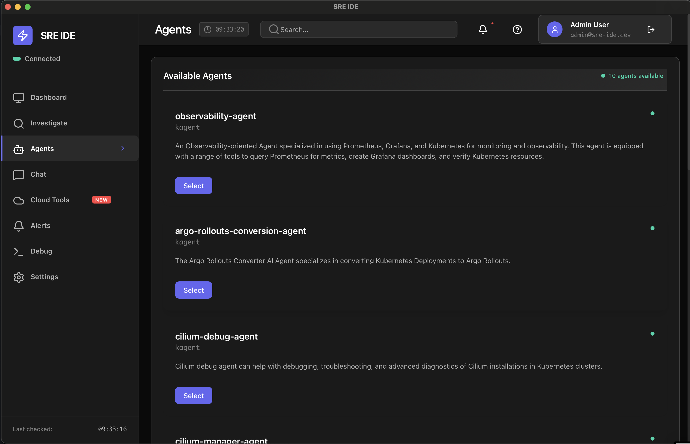
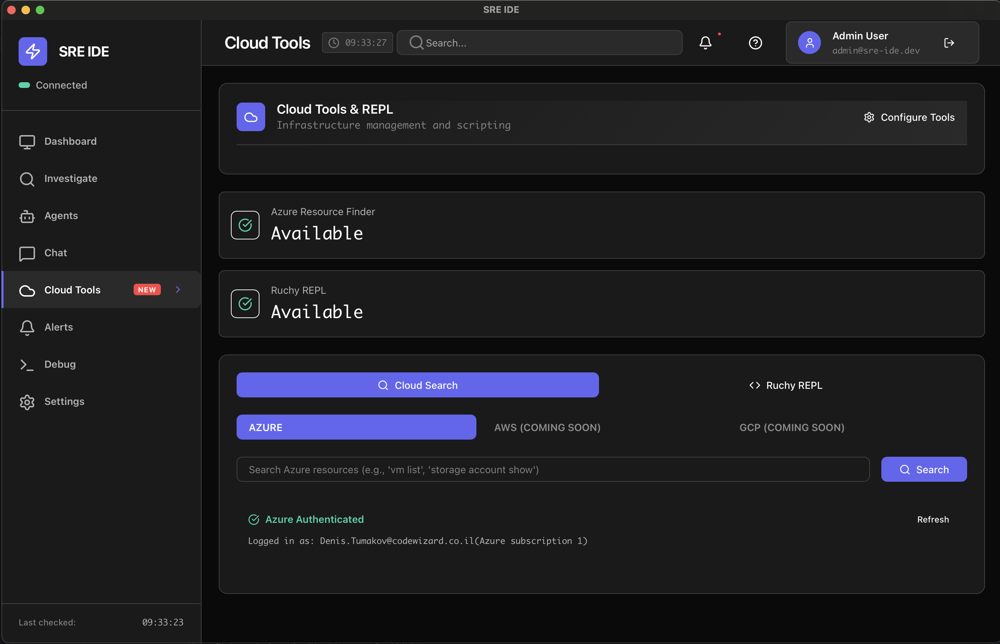
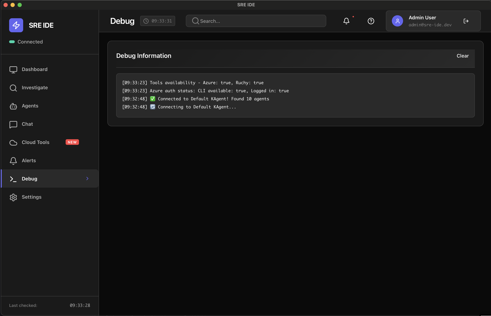
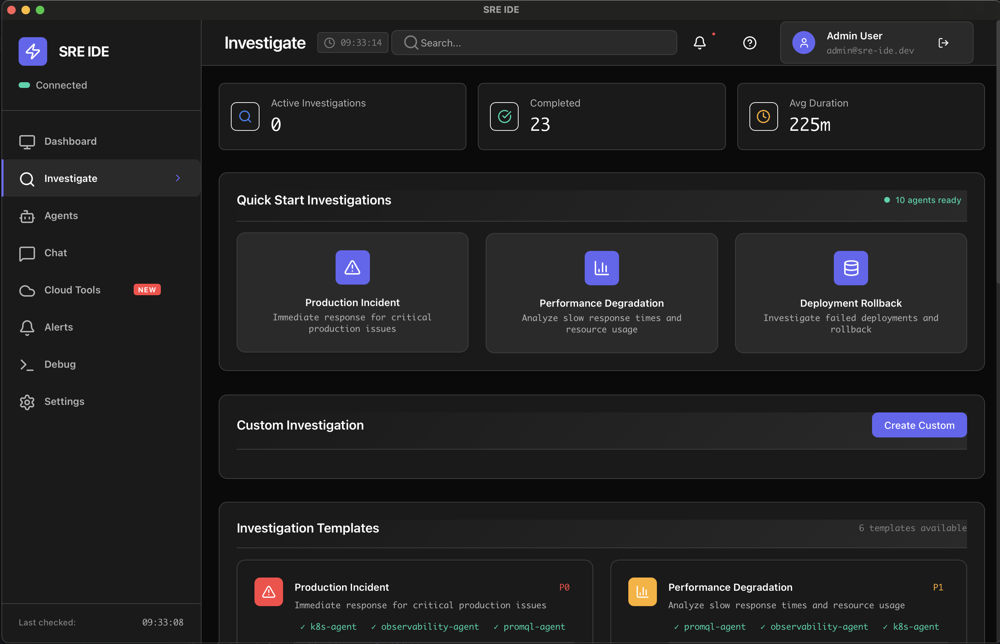
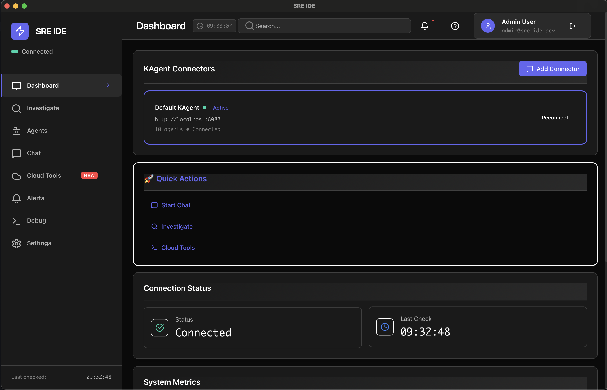
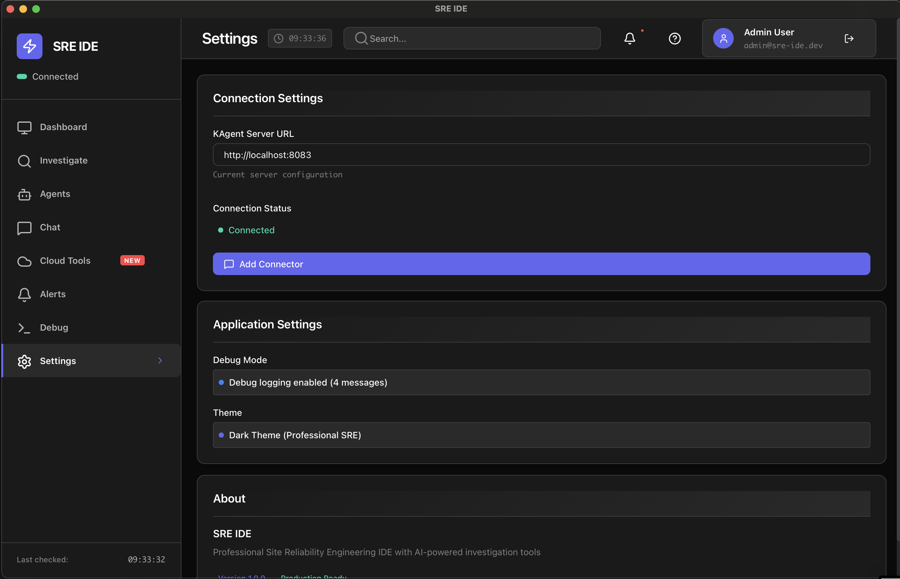

# SRE IDE - Releases

This repository contains official releases of the SRE IDE desktop application.

## 🚀 Download SRE IDE

### Latest Release: v0.1.0










### 🔒 Security Disclaimer

**Important**: This application is developed by an independent enthusiast, not a verified developer. Use at your own discretion.

**macOS (Apple Silicon)**
- [SRE IDE v0.1.0 - macOS ARM64](releases/v0.1.0/sre-ide-v0.1.0-macos-arm64.dmg)
- [SRE IDE v0.1.0 - macOS ARM64 (Direct Install)](releases/v0.1.0/sre-ide-v0.1.0-macos-arm64.zip)

### ⚠️ macOS Security Notice

If you encounter a "damaged" or "unidentified developer" error when trying to open SRE IDE, this is due to macOS Gatekeeper security. To resolve this:

1. **Option 1 (Recommended)**: Right-click the app and select "Open" from the context menu
2. **Option 2**: Use Terminal to remove the quarantine attribute:
   ```bash
   sudo xattr -rd com.apple.quarantine /Applications/sre-ide.app
   ```


**Windows**
- [SRE IDE v0.1.0 - Windows x64](releases/v0.1.0/sre-ide-v0.1.0-windows-x64.msi)

**Linux**
- [SRE IDE v0.1.0 - Linux x64](releases/v0.1.0/sre-ide-v0.1.0-linux-x64.AppImage)

## 📋 System Requirements

### macOS
- macOS 10.15 (Catalina) or later
- Apple Silicon (M1/M2) or Intel processor
- 4GB RAM minimum, 8GB recommended
- 500MB available disk space

### Windows
- Windows 10 (version 1903) or later
- x64 processor
- 4GB RAM minimum, 8GB recommended
- 500MB available disk space

### Linux
- Ubuntu 18.04+, Fedora 32+, or similar
- x64 processor
- 4GB RAM minimum, 8GB recommended
- 500MB available disk space

## 🛠️ Installation

### macOS
1. Download the `.dmg` file
2. Double-click to mount the disk image
3. Drag SRE IDE to your Applications folder
4. Launch from Applications or Spotlight

### Windows
1. Download the `.msi` file
2. Double-click to run the installer
3. Follow the installation wizard
4. Launch from Start Menu

### Linux
1. Download the `.AppImage` file
2. Make it executable: `chmod +x sre-ide-*.AppImage`
3. Run: `./sre-ide-*.AppImage`

## 🔧 Features

- **Multi-Agent Investigation**: Work with specialized SRE agents
- **Real-time Chat**: Interactive conversations with AI agents
- **Investigation Templates**: Pre-built investigation workflows
- **PDF Reports**: Generate professional investigation reports
- **Cloud Tools Integration**: Azure Resource Finder and more
- **Security Scanning**: Automatic sensitive data detection
- **Token Optimization**: Efficient conversation management

## 📝 Release Notes

### v0.1.0 (Latest)
- Initial release
- Multi-agent investigation system
- Real-time chat with SRE agents
- PDF report generation
- Cloud tools integration
- Security and token optimization features

## �� Contributing

For bug reports, feature requests, or contributions, please visit the main repository:
[SRE IDE Main Repository](https://github.com/your-username/sre-ide)

## 📄 License

This project is licensed under the MIT License - see the [LICENSE](LICENSE) file for details.

## 🆘 Support

- **Issues**: [GitHub Issues](https://github.com/your-username/sre-ide/issues)
- **Discussions**: [GitHub Discussions](https://github.com/your-username/sre-ide/discussions)
- **Documentation**: [Wiki](https://github.com/your-username/sre-ide/wiki)

---

**SRE IDE** - Professional SRE investigation and analysis tool
